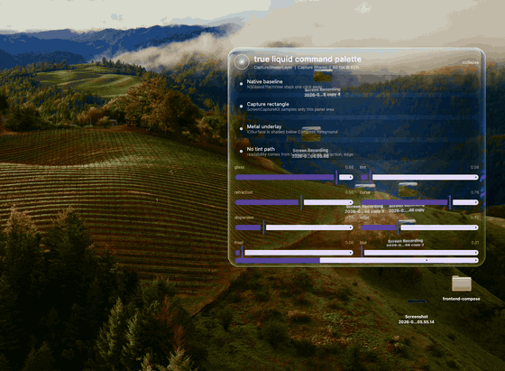

# True Liquid Glass for Compose Multiplatform

The first Compose Multiplatform Liquid Glass library with a native macOS ScreenCaptureKit + AppKit + Metal backend that refracts the real desktop behind a Compose Desktop window.

<p align="center">
  <a href="docs/assets/true-liquid-glass-macos.mp4">
    
  </a>
  <br>
  <sub>Click for the 50 fps H.264 capture.</sub>
</p>

True Liquid has two API layers:

- `TrueLiquidWindow` for Compose Desktop on macOS. This is the flagship path: ScreenCaptureKit samples the real desktop/window rectangle behind the transparent window, Metal shades that IOSurface, and Compose draws foreground UI above it.
- `Modifier.trueLiquidSource` plus `Modifier.trueLiquidSurface` for Compose content on Android and Skiko targets. This samples explicitly marked Compose content and renders a liquid surface over it.

The macOS backend is intentionally stronger than ordinary Compose-only glass because it can refract real desktop pixels behind the root window.

## Status

`0.1.0-alpha01` is the first intended alpha line. The artifact is not published yet.

Platform shape:

| Platform | Window-level true desktop glass | Compose-content glass | Status |
| --- | --- | --- | --- |
| macOS Compose Desktop/JVM | Yes. ScreenCaptureKit + AppKit + Metal. | Yes. Skiko RuntimeEffect path. | Alpha flagship. |
| Android | No root-window desktop capture. | Yes on Android 13+ through RuntimeShader. | Alpha content surface. |
| iOS | No root-window desktop capture. | Configured through Skiko RuntimeEffect. | WIP, not visually certified yet. |
| Web/Wasm/JS | No root-window desktop capture. | Configured through Skiko RuntimeEffect where available. | WIP, not visually certified yet. |
| Linux Desktop/JVM | WIP. No native window-capture backend yet. | WIP through Skiko RuntimeEffect. | WIP. |
| Windows Desktop/JVM | WIP. No native window-capture backend yet. | WIP through Skiko RuntimeEffect. | WIP. |

The current library is macOS-first for the root window replacement use case. Other platforms get the portable Compose-content surface API while native desktop capture backends are intentionally deferred.

## Dependency

```kotlin
repositories {
    mavenCentral()
}

dependencies {
    implementation("io.github.sdfgsdfgd:true-liquid:0.1.0-alpha01")
}
```

For local development, use the included demo and build tasks until the artifact is published.

## macOS Window

Call `TrueLiquidRuntime.configureProcess()` before creating Compose windows.

```kotlin
fun main() = application {
    TrueLiquidRuntime.configureProcess()

    val state = rememberWindowState(size = DpSize(780.dp, 530.dp))
    val style = TrueLiquidDefaults.spotlightStyle()

    TrueLiquidWindow(
        title = "True Liquid",
        state = state,
        style = style,
        onCloseRequest = ::exitApplication,
    ) {
        Box(Modifier.fillMaxSize().trueLiquidDragRegion()) {
            Text(backendState.label)
        }
    }
}
```

`TrueLiquidWindowScope` exposes:

- `window`: the underlying `ComposeWindow`.
- `backendState`: the selected native backend and Screen Recording permission state.
- `beginWindowMove()` / `endWindowMove()`: programmatic native move sessions for command/hotkey move flows.

Use `Modifier.trueLiquidDragRegion()` on regions that should move the window. Interactive controls should omit it unless dragging is intended.

## Native AppKit Glass

For cheap native macOS glass without Screen Recording permission or ScreenCaptureKit capture, use the same window API with the native-glass style:

```kotlin
TrueLiquidWindow(
    title = "Native Glass",
    state = rememberWindowState(size = DpSize(520.dp, 180.dp)),
    style = TrueLiquidDefaults.nativeGlassStyle(cornerRadius = 28f),
    onCloseRequest = ::exitApplication,
) {
    Text(backendState.label)
}
```

This uses `NSGlassEffectView` when available and falls back to `NSVisualEffectView`. It is fast and system-native, but it is not the flagship True Liquid capture shader path: it does not refract sampled desktop pixels through the Metal lens shader.

## Compose-Content Surface

Use this path for Android, web, iOS, native Skiko, and ordinary Compose content inside desktop apps.

```kotlin
@Composable
fun LiquidContent() {
    val liquid = rememberTrueLiquidState()
    val style = TrueLiquidDefaults.clearLensStyle()

    Box {
        Image(
            painter = painterResource("background.jpg"),
            contentDescription = null,
            modifier = Modifier
                .fillMaxSize()
                .trueLiquidSource(liquid),
        )

        Box(
            Modifier
                .size(220.dp, 72.dp)
                .trueLiquidSurface(liquid, style, RoundedCornerShape(28.dp)),
        ) {
            Text("Liquid")
        }
    }
}
```

`trueLiquidSource` marks content that can be sampled. `trueLiquidSurface` renders the liquid effect from the latest source layers and then draws its own content above the glass.

If you are coming from other Compose liquid-glass libraries, the portable API maps like this:

| Source idea | True Liquid API | Notes |
| --- | --- | --- |
| FletchMcKee Liquid's `rememberLiquidState()` | `rememberTrueLiquidState()` | Shared state that connects sampled content with liquid surfaces. |
| FletchMcKee Liquid's `Modifier.liquefiable(state)` | `Modifier.trueLiquidSource(state)` | Marks a Compose subtree as a sampleable source layer. |
| FletchMcKee Liquid's `Modifier.liquid(state)` | `Modifier.trueLiquidSurface(state, style, shape)` | Draws the refractive material over the latest source pixels. |
| Kyant Backdrop-style buttons, toggles, sliders, tabs | Build components with `trueLiquidSurface` | True Liquid stays low-level: compose your own controls from the source/surface primitives. |

The portable API is for content already inside Compose. On macOS, `TrueLiquidWindow` is stronger because it samples the real desktop behind the root window.

## Permission API

The capture-backed macOS window mode requires Screen Recording permission for the running Java app or packaged app.

```kotlin
when (TrueLiquidPermissions.screenCaptureStatus()) {
    TrueLiquidScreenCapturePermission.Granted -> Unit
    TrueLiquidScreenCapturePermission.NotGranted ->
        TrueLiquidPermissions.openScreenRecordingSettings()
    TrueLiquidScreenCapturePermission.Unsupported -> Unit
}
```

`TrueLiquidMode.Auto` falls back to native AppKit glass/visual effect when the capture shader path is not available.

## Style

```kotlin
val style = TrueLiquidDefaults.spotlightStyle(
    glassAlpha = 0.86f,
    tintAlpha = 0.08f,
    refraction = 0.56f,
    curve = 0.76f,
    dispersion = 0.24f,
    frost = 0.06f,
    blur = 0.01f,
    saturation = 1.16f,
    contrast = 0.05f,
    luminanceClamp = 0.28f,
    edge = 0.32f,
    depth = 0.78f,
    innerShadow = 0.46f,
    outerShadow = 0f,
    cornerRadius = 34f,
    captureScale = 0.82f,
    fps = 60,
)
```

Presets:

- `spotlightStyle()`: stable command-palette default.
- `clearLensStyle()`: low tint, high optical sample alpha.
- `prismStyle()`: stronger curve, depth, and dispersion.
- `nativeGlassStyle()`: AppKit fallback without ScreenCaptureKit.

## Development

```bash
gradle classes
gradle :true-liquid:jvmJar
gradle :demo:run
gradle verifyZenith10
```

`verifyZenith10` launches the demo and runs the hard video drag regression used to guard the macOS smoothness path.

The demo is non-instrumented by default. Instrumentation is opt-in through the scoring tools.

## Lineage

True Liquid stands on public work from the Compose liquid-glass community:

| Project | What it contributes | How True Liquid differs |
| --- | --- | --- |
| [FletchMcKee/liquid](https://github.com/FletchMcKee/liquid) | Compose Multiplatform source/surface architecture for sampling already-composed content. | True Liquid keeps that portable idea, then adds a native macOS root-window backend that samples the actual desktop behind the window. |
| [Kyant0/AndroidLiquidGlass](https://github.com/Kyant0/AndroidLiquidGlass) | Strong Android RuntimeShader lens/refraction vocabulary. | True Liquid borrows the vocabulary, keeps one shared style model, and treats Android as the portable content-surface path. |

Both projects are Apache-2.0. See `NOTICE`.

True Liquid's macOS ScreenCaptureKit/AppKit/Metal backend is separate native work focused on refracting real desktop pixels behind a Compose Desktop window.
